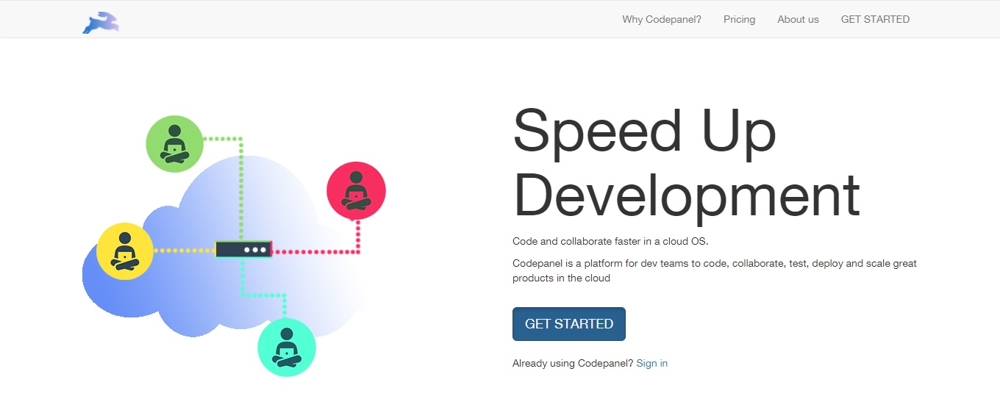
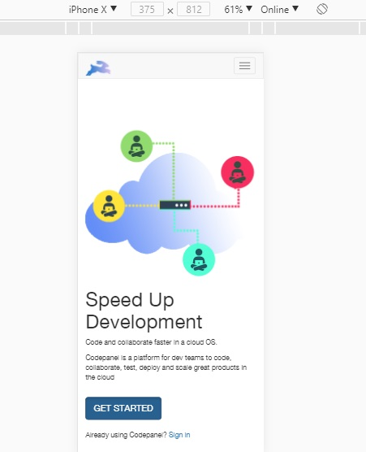

# Codepanel_illustration

**Link to deployed site: [https://niharika04.github.io/Codepanel_illustration/](https://niharika04.github.io/Codepanel_illustration/)**

### Purpose:
A graphic Design task showing skills - photoshop, html, css, mediaqueries, bootstrap.
Codepanel is a platform for dev teams to code, collaborate, test, deploy and scale great products in the cloud.
I had to design an illustration to be placed on the left side to help understand the concept better.

### Live pages:

#### Desktop

#### Iphone X

### Technology Used:

HTML
CSS
Bootstrap
Media Queries
Photoshop